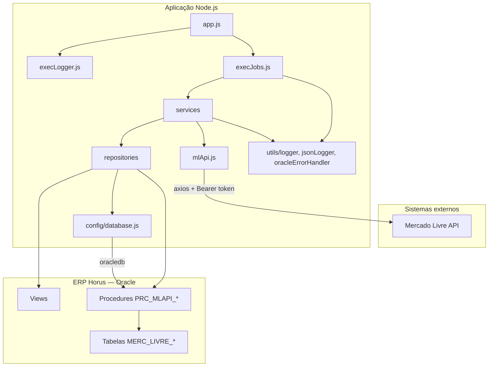
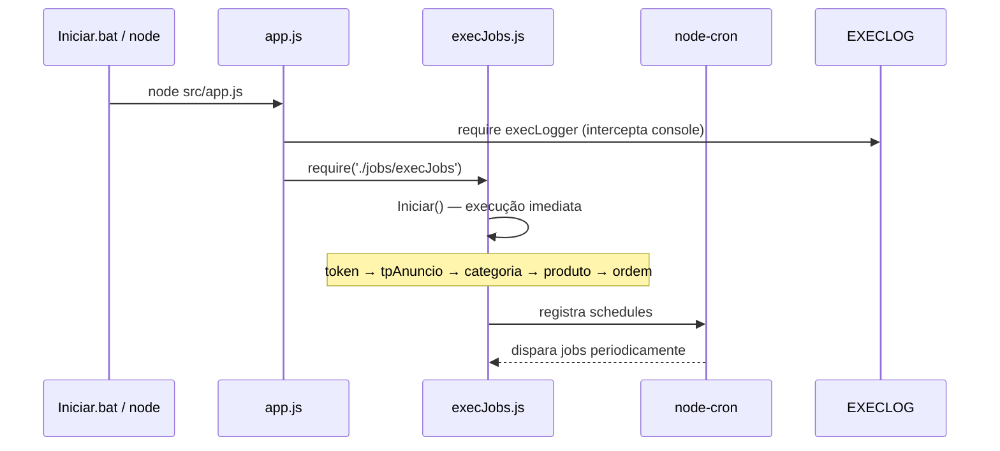
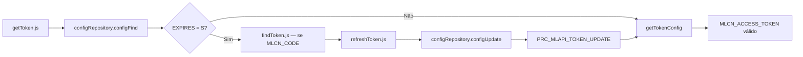
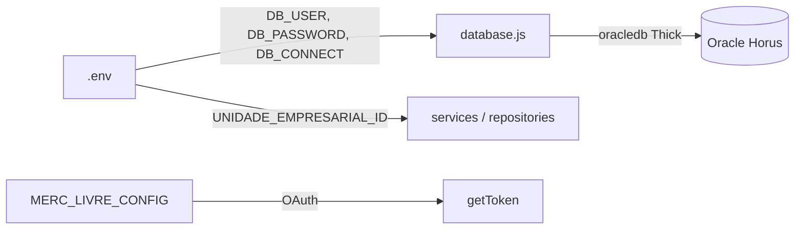
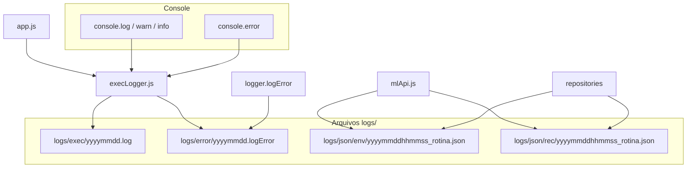

# Arquitetura do Projeto

Documento de referência da arquitetura do serviço **Horus — Integração Mercado Livre**.

## Visão geral

O projeto é um **serviço de sincronização batch** (sem API HTTP própria). Um processo Node.js roda continuamente, executa jobs agendados com `node-cron`, consulta a **API REST do Mercado Livre** e persiste os dados no **Oracle do ERP Horus** via procedures PL/SQL.



## Camadas

| Camada | Responsabilidade | Localização |
|--------|------------------|-------------|
| **Entrada** | Bootstrap da aplicação | `src/app.js` |
| **Orquestração** | Agendamento e disparo dos jobs | `src/jobs/execJobs.js` |
| **Serviços** | Regras de integração e chamadas à API ML | `src/services/**` |
| **Repositórios** | Persistência no Oracle (procedures) | `src/repositories/**` |
| **Infraestrutura** | Conexão Oracle, logs, tratamento de erros | `src/config/`, `src/utils/` |
| **Banco de dados** | Modelo de dados e regras de negócio Horus | `src/oracle/` |

### Princípios adotados

- **Separação por domínio:** cada entidade (token, produto, ordem, categoria, tipo de anúncio) possui pasta própria em `services/` e `repositories/`.
- **Persistência delegada ao Oracle:** o Node.js não faz `INSERT`/`UPDATE` direto; chama procedures `PRC_MLAPI_*`, onde ficam validações e regras do Horus.
- **Token centralizado:** serviços que consomem a API usam `getTokenConfig()` (validação + access token); renovação OAuth em `getToken.getToken()`.
- **Cliente HTTP único:** chamadas à API ML passam por `utils/mlApi.js`, que registra JSON enviado/recebido automaticamente.
- **Resiliência por item:** falha em uma ordem ou produto é logada; o loop continua nos demais registros.
- **Processamento sequencial:** produtos e pedidos são iterados um a um (sem fila ou paralelismo).

## Fluxo de inicialização



## Módulos de integração

### 1. Autenticação OAuth



| Componente | Arquivo | API / Banco |
|------------|---------|-------------|
| Orquestrador | `services/token/getToken.js` | View `VIEW_MERC_LIVRE_CONFIG` |
| Validação para API | `getTokenConfig()` em `getToken.js` | Garante `MLCN_ACCESS_TOKEN`; lança se indisponível |
| Primeiro token | `services/token/findToken.js` | `POST /oauth/token` via `mlApi.request('findToken', ...)` |
| Renovação | `services/token/refreshToken.js` | `POST /oauth/token` via `mlApi.request('refreshToken', ...)` |
| Leitura config | `repositories/configRepository.js` | `VIEW_MERC_LIVRE_CONFIG` + log JSON rec |
| Gravação token | `repositories/configRepository.js` | `PRC_MLAPI_TOKEN_UPDATE` + log JSON env/rec |

Credenciais (`client_id`, `client_secret`, `code`, `redirect_uri`) ficam em `MERC_LIVRE_CONFIG`. A view calcula o campo `EXPIRES` comparando `MLCN_TOKEN_DT_VAL` com `SYSDATE`.

### 2. Tipos de anúncio

```
getTpAnuncios.js  →  mlApi.get('getTpAnuncios', ...)  →  GET /sites/MLB/listing_types
tpAnuncios.js     →  tpAnuncioRepository  →  PRC_MLAPI_TP_ANUNCIO_UPDATE  →  MERC_LIVRE_TP_ANUNCIO
```

### 3. Categorias

```
getCategorias.js  →  mlApi.get('getCategorias', ...)  →  GET /sites/MLB/categories
categorias.js     →  categoriaRepository  →  PRC_MLAPI_CATEGORIA_UPDATE  →  MERC_LIVRE_CATEGORIA
```

### 4. Produtos

```mermaid
flowchart TD
    A[getProdutosAll] -->|GET /users/{id}/items/search| B[Lista de IDs]
    B --> C[getProduto]
    C -->|GET /items/{id}| D[Dados do anúncio]
    D --> E[produtos.js — monta objeto]
    E --> F[extractSKU / extractGTIN]
    F --> G[produtoRepository.produtoUpdate]
    G --> H[PRC_MLAPI_PRODUTO_UPDATE]
    H --> I[MERC_LIVRE_PRODUTO]
    G -.->|erro| J[logger.logError + próximo produto]
```

Campos extraídos dos atributos ML: `SELLER_SKU` e `GTIN`. Erro em um produto não interrompe o lote.

### 5. Pedidos

```mermaid
flowchart TD
    A[getOrdensAll] -->|GET /orders/search| B[Filtro: paid + approved]
    B --> C[getOrdem]
    C -->|GET /orders/{id}| D[Cabeçalho + itens]
    D --> E[getDadosFaturamento]
    E -->|GET /orders/{id}/billing_info| F[CPF/CNPJ, nome, endereço fiscal]
    D --> G[getEndereco]
    G -->|GET /shipments/{id}| H[Endereço de entrega]
    F --> I[ordemRepository]
    H --> J[ordemEndRepository]
    D --> K[ordemItemRepository]
    I --> L[PRC_MLAPI_ORDEM_UPDATE]
    J --> M[PRC_MLAPI_ORDEM_END_UPDATE]
    K --> N[PRC_MLAPI_ORDEM_ITEM_UPDATE]
    I -.->|erro por ordem| O[logger.logError + próxima ordem]
```

Somente pedidos com `status = paid` e pagamento `approved` entram na sincronização. Cada ordem (API ML + gravação Oracle) está em `try/catch` isolado.

## Camada de persistência (Oracle)

### Tabelas principais

| Tabela | Conteúdo |
|--------|----------|
| `MERC_LIVRE_CONFIG` | Credenciais OAuth, tokens, user_id |
| `MERC_LIVRE_PRODUTO` | Anúncios sincronizados |
| `MERC_LIVRE_ORDEM` | Cabeçalho do pedido (valores, cliente, endereço fiscal) |
| `MERC_LIVRE_ORDEM_ITEM` | Itens do pedido |
| `MERC_LIVRE_ORDEM_END` | Endereço de entrega (shipping) |
| `MERC_LIVRE_CATEGORIA` | Categorias MLB |
| `MERC_LIVRE_TP_ANUNCIO` | Tipos de listagem |

### Views

| View | Uso |
|------|-----|
| `VIEW_MERC_LIVRE_CONFIG` | Leitura de config OAuth + flag `EXPIRES` |
| `VIEW_MERC_LIVRE_PRODUTO` | Consulta de produtos no Horus |

### Procedures (contrato Node ↔ Oracle)

| Procedure | Chamada por |
|-----------|-------------|
| `PRC_MLAPI_TOKEN_UPDATE` | `configRepository.configUpdate` |
| `PRC_MLAPI_PRODUTO_UPDATE` | `produtoRepository.produtoUpdate` |
| `PRC_MLAPI_ORDEM_UPDATE` | `ordemRepository.ordemUpdate` |
| `PRC_MLAPI_ORDEM_ITEM_UPDATE` | `ordemItemRepository.ordemItemUpdate` |
| `PRC_MLAPI_ORDEM_END_UPDATE` | `ordemEndRepository.ordemEndUpdate` |
| `PRC_MLAPI_CATEGORIA_UPDATE` | `categoriaRepository.categoriaUpdate` |
| `PRC_MLAPI_TP_ANUNCIO_UPDATE` | `tpAnuncioRepository.tpAnuncioUpdate` |

Erros de negócio Oracle (`ORA-20000`) são interpretados por `utils/oracleErrorHandler.js` antes de propagar ao caller.

## Agendamento (node-cron)

| Job | Expressão cron | Período |
|-----|----------------|---------|
| `refreshToken` | `*/30 * * * *` | 30 minutos |
| `tpAnuncioSave` | `0 */12 * * *` | 12 horas |
| `categoriasSave` | `0 */12 * * *` | 12 horas |
| `produtosSave` | `*/5 * * * *` | 5 minutos |
| `ordensSave` | `*/5 * * * *` | 5 minutos |

Na subida, `Iniciar()` executa **todos** os jobs em sequência antes de registrar os crons.

## Configuração e variáveis



| Origem | Variável / campo | Uso |
|--------|------------------|-----|
| `.env` | `DB_USER`, `DB_PASSWORD`, `DB_CONNECT` | Conexão Oracle |
| `.env` | `UNIDADE_EMPRESARIAL_ID` | Identifica a loja/unidade no Horus |
| `.env` | `ORACLE_CLIENT_LIB_DIR` | Caminho do Oracle Instant Client (modo Thick) |
| Banco | `MLCN_CLIENT_ID`, `MLCN_CLIENT_SECRET`, etc. | OAuth Mercado Livre |

## Tratamento de erros e logs



| Mecanismo | Arquivo | Destino | Comportamento |
|-----------|---------|---------|---------------|
| Exec logger | `utils/execLogger.js` | `logs/exec/` | Espelha todo output do console; linha com `HH:mm:ss` |
| Error logger | `utils/logger.js` | `logs/error/` | Erros tratados + `console.error`; arquivo `yyyymmdd.logError` |
| JSON logger | `utils/jsonLogger.js` | `logs/json/env/` e `rec/` | Payload enviado/recebido; tokens mascarados |
| Cliente ML | `utils/mlApi.js` | via jsonLogger | Wrapper axios; rotina no nome do arquivo |
| Handler Oracle | `utils/oracleErrorHandler.js` | — | Extrai mensagem de `ORA-20000` |
| Jobs | `execJobs.js` | `logs/error/` | `try/catch` por job; falha não interrompe os demais |
| Pedidos | `ordens.js` | `logs/error/` | `try/catch` por ordem; loop continua |
| Produtos | `produtos.js` | `logs/error/` | `try/catch` por produto; loop continua |
| Billing / shipping | `getDadosFaturamento.js`, `getEndereco.js` | `logs/json/rec/` | Falha API → retorna `{}` |

## Dependências externas

```
┌─────────────────┐     HTTPS      ┌──────────────────────┐
│  Node.js App    │ ──────────────►│ api.mercadolibre.com │
└────────┬────────┘                └──────────────────────┘
         │
         │ oracledb (Thick)
         ▼
┌─────────────────┐
│  Oracle Horus   │  schema HORUS
└─────────────────┘
```

| Pacote npm | Papel |
|------------|-------|
| `axios` | HTTP interno em `mlApi.js` |
| `oracledb` | Driver Oracle (modo Thick) |
| `node-cron` | Agendamento |
| `dotenv` | Variáveis de ambiente |
| `qs` | Body `x-www-form-urlencoded` no OAuth |
| `winston` | Declarado; logging efetivo via `logger.js`, `execLogger.js`, `jsonLogger.js` |

## Mapa de arquivos por responsabilidade

```
src/
├── app.js                          # Entry point (execLogger → dotenv → execJobs)
├── config/
│   └── database.js                 # initOracleClient + getConnection
├── jobs/
│   └── execJobs.js                 # Cron + Iniciar()
├── services/
│   ├── token/
│   │   ├── getToken.js             # OAuth + getTokenConfig()
│   │   ├── findToken.js            # authorization_code (mlApi)
│   │   └── refreshToken.js         # refresh_token (mlApi)
│   ├── tpAnuncio/
│   │   ├── tpAnuncios.js           # Orquestrador
│   │   └── getTpAnuncios.js        # mlApi client
│   ├── categoria/
│   │   ├── categorias.js
│   │   └── getCategorias.js
│   ├── produto/
│   │   ├── produtos.js             # Loop + try/catch por produto
│   │   ├── getProdutosAll.js
│   │   └── getProduto.js
│   └── ordem/
│       ├── ordens.js               # Orquestrador + try/catch por ordem
│       ├── getOrdensAll.js
│       ├── getOrdem.js
│       ├── getDadosFaturamento.js
│       └── getEndereco.js
├── repositories/                   # Procedures + logJsonEnv/logJsonRec
│   ├── configRepository.js
│   ├── produtoRepository.js
│   ├── ordemRepository.js
│   ├── ordemItemRepository.js
│   ├── ordemEndRepository.js
│   ├── categoriaRepository.js
│   └── tpAnuncioRepository.js
├── utils/
│   ├── execLogger.js               # Console → logs/exec + logs/error
│   ├── logger.js                   # logError → logs/error
│   ├── jsonLogger.js               # logs/json/env e rec
│   ├── mlApi.js                    # Cliente HTTP ML + log JSON
│   └── oracleErrorHandler.js
└── oracle/                         # DDL — não executado pelo Node
    ├── *.tab                       # Tabelas
    ├── *.vw                        # Views
    └── prc_mlapi_*.prc             # Procedures

logs/                               # Não versionado (.gitignore)
├── exec/                           # yyyymmdd.log
├── error/                          # yyyymmdd.logError
└── json/
    ├── env/                        # JSON enviado/gerado
    └── rec/                        # JSON recebido
```

## Ambiente de desenvolvimento

O `docker-compose.yml` provê um **Oracle XE 21** local (`gvenzl/oracle-xe:21.3.0`) na porta `1521`, útil para testes. Em produção, a aplicação conecta ao Oracle do ambiente Horus real.

## Limitações e características atuais

- **Unidade única por instância:** `UNIDADE_EMPRESARIAL_ID` vem do `.env`; uma execução atende uma unidade empresarial.
- **Sem webhook:** sincronização é **pull** periódica, não reativa a notificações do Mercado Livre.
- **Sem API REST exposta:** o serviço não oferece endpoints HTTP; é exclusivamente worker/cron.
- **Conexão por operação:** cada chamada de repository abre e fecha conexão Oracle (`getConnection` / `close`).
- **Site fixo MLB:** categorias e tipos de anúncio usam `sites/MLB` (Brasil).
- **Logs locais:** toda execução gera arquivos em `logs/` (exec, error, json); não versionados.
- **Repasse ao vendedor:** não implementado (ver `MercadoLivre-API.md` seção 9).

Última atualização: junho/2026.

## Referência

Para instalação, configuração e execução, consulte o [README.md](README.md).
