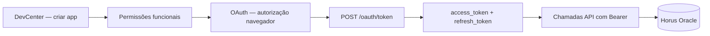
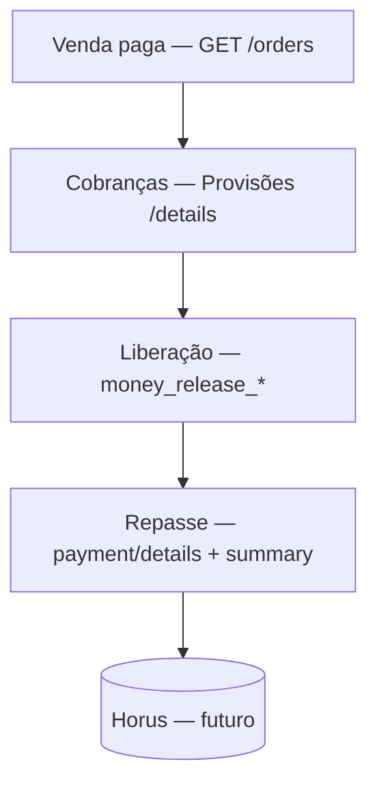

# Mercado Livre — Documentação de Integração com a API

> Resumo compilado via MCP **`mercadolibre-mcp-server`** (documentação oficial MLB, pt_br).  
> Complementa [OAUTH-TOKEN.md](OAUTH-TOKEN.md) (fluxo OAuth detalhado) e [ARQUITETURA.md](ARQUITETURA.md) (implementação no Horus).

**Portal:** https://developers.mercadolivre.com.br  
**DevCenter:** https://developers.mercadolivre.com.br/devcenter  
**Base URL API:** `https://api.mercadolibre.com`  
**Site deste projeto:** **MLB** (Brasil)

---

## Índice de documentação oficial

| Tema | Path MCP | URL |
|------|----------|-----|
| API Docs (índice) | `api-docs-pt-br-1` | https://developers.mercadolivre.com.br/pt_br/api-docs-pt-br |
| Criar aplicação | `crie-uma-aplicacao-no-mercado-livre` | https://developers.mercadolivre.com.br/pt_br/crie-uma-aplicacao-no-mercado-livre |
| Permissões funcionais | `permissoes-funcionais` | https://developers.mercadolivre.com.br/pt_br/permissoes-funcionais |
| Autenticação OAuth | `autenticacao-e-autorizacao` | https://developers.mercadolivre.com.br/pt_br/autenticacao-e-autorizacao |
| Segurança de token | `desenvolvimento-seguro` | https://developers.mercadolivre.com.br/pt_br/desenvolvimento-seguro |
| Gestão OAuth/tokens | `gestao-de-identidades-e-acessos-oauth-e-tokens` | https://developers.mercadolivre.com.br/pt_br/gestao-de-identidades-e-acessos-oauth-e-tokens |
| Pedidos | `pedidos-e-opinioes` | https://developers.mercadolivre.com.br/pt_br/pedidos-e-opinioes |
| Publicar produtos | `publicacao-de-produtos` | https://developers.mercadolivre.com.br/pt_br/publicacao-de-produtos |
| Identificadores (SKU/GTIN) | `identificadores-de-produtos` | https://developers.mercadolivre.com.br/pt_br/identificadores-de-produtos |
| Notificações (webhooks) | `produto-receba-notificacoes` | https://developers.mercadolivre.com.br/pt_br/produto-receba-notificacoes |
| Boas práticas plataforma | `boas-praticas-para-usar-a-plataforma` | https://developers.mercadolivre.com.br/pt_br/boas-praticas-para-usar-a-plataforma |
| Realizar testes | `realizacao-de-testes` | https://developers.mercadolivre.com.br/pt_br/realizacao-de-testes |
| Gerenciar IPs | `gerenciar-ips-de-um-aplicativo` | https://developers.mercadolivre.com.br/pt_br/gerenciar-ips-de-um-aplicativo |
| Erro 403 | `erro-403` | https://developers.mercadolivre.com.br/pt_br/erro-403 |
| Relatórios de Faturamento | `relatorios-de-faturamento` | https://developers.mercadolivre.com.br/pt_br/relatorios-de-faturamento |
| Relatórios de Pagamentos | `pagamentos` | https://developers.mercadolivre.com.br/pt_br/pagamentos |
| Provisões (detalhe cobranças) | `provisoes` | https://developers.mercadolivre.com.br/pt_br/provisoes |
| Pagamentos na order | `gerenciamento-de-pagamentos` | https://developers.mercadolivre.com.br/pt_br/gerenciamento-de-pagamentos |
| Conciliação V1 | `conciliacao-v1` | https://developers.mercadolivre.com.br/pt_br/conciliacao-v1 |
| Conciliação V2 | `conciliacao-v2` | https://developers.mercadolivre.com.br/pt_br/conciliacao-v2 |
| Liberação de Pagamentos V2 | `liberacao-de-pagamentos-v2` | https://developers.mercadolivre.com.br/pt_br/liberacao-de-pagamentos-v2 |
| Conciliações (exclusiva) | `conciliacoes-exclusiva` | https://developers.mercadolivre.com.br/pt_br/conciliacoes-exclusiva |

---

## Fluxo de integração (visão geral)



1. Criar aplicação no DevCenter → `client_id` + `client_secret`
2. Configurar permissões funcionais e `redirect_uri` (HTTPS, estática)
3. Autorizar com usuário **administrador** da conta ML
4. Trocar `code` por tokens via `POST /oauth/token`
5. Usar `Authorization: Bearer {access_token}` em todas as chamadas
6. Renovar com `refresh_token` quando expirar (6 horas)

Detalhes OAuth: ver [OAUTH-TOKEN.md](OAUTH-TOKEN.md).

---

## 1. Criar aplicação no DevCenter

**Doc:** `crie-uma-aplicacao-no-mercado-livre`

### Configurações obrigatórias

| Campo | Regra |
|-------|-------|
| `client_id` / `client_secret` | Gerados ao criar o app |
| `redirect_uri` | **HTTPS**, URL **estática**, idêntica ao cadastro (sem parâmetros variáveis) |
| PKCE | Opcional, recomendado; se habilitado → **obrigatório** |
| Escopos | Leitura (GET) / Leitura e escrita (PUT, POST, DELETE) |
| Tópicos notificação | Orders, Items, Shipments, Messages, etc. |
| Conta | Proprietário da integração (preferencialmente PJ) |

### Tópicos de notificação (DevCenter)

Principais: **Orders**, **Messages**, **Items**, **Catalog**, **Shipments**, **Promotions**.

URL de callback deve estar acessível e responder HTTP 200 rapidamente.

### Renovação do Client Secret

- Renovar `client_secret` **invalida tokens** existentes
- Opções: "Renove agora" ou "Programar renovação" (até 7 dias)
- Atualizar `MLCN_CLIENT_SECRET` no Horus após renovação

### Tipos de aplicação (escopos)

| Tipo | Comportamento |
|------|---------------|
| Somente leitura | Apenas GET |
| Online leitura/escrita | Alterações enquanto token válido |
| **Offline leitura/escrita** | Ações com usuário offline → exige `refresh_token` (**caso do Horus**) |

---

## 2. Permissões funcionais

**Doc:** `permissoes-funcionais`

Permissões necessárias para o projeto Horus:

| Permissão ML | Recursos API | Uso no projeto |
|--------------|--------------|----------------|
| **Usuários** (default) | users | OAuth, `user_id` |
| **Publicação e sincronização** | items, categories, listing_types, prices | Produtos, categorias, tipos de anúncio |
| **Vendas e envios** | orders, shipments, billing | Pedidos, endereço, faturamento |
| **Comunicação pré e pós-venda** | questions, messages, claims, returns | Perguntas nos anúncios — **obrigatória para sync de perguntas** |
| **Faturamento** | invoices, billing, conciliação | Repasse ao vendedor — **não implementado** |

### Checklist DevCenter — perguntas e mensagens

Passos manuais no [DevCenter](https://developers.mercadolivre.com.br/devcenter) (Meus aplicativos → editar app):

1. **Permissões funcionais:** habilitar **Comunicação pré e pós-venda** (leitura e escrita).
2. **Reautorizar OAuth:** após alterar permissões, o vendedor deve refazer o fluxo de autorização para conceder o novo grant.
3. **Tópicos de notificação (opcional):** marcar `questions` e `messages` se no futuro houver callback HTTP — hoje o Horus usa **polling** (ver seção 5).
4. **Escopos:** manter `offline_access`, `read` e `write`.

Sem a permissão de comunicação, chamadas a `/my/received_questions/search` retornam HTTP 403.

### Erro sem permissão

```json
{
  "code": "PA_UNAUTHORIZED_RESULT_FROM_POLICIES",
  "blocked_by": "PolicyAgent",
  "message": "At least one policy returned UNAUTHORIZED.",
  "status": 403
}
```

Solução: habilitar a permissão correspondente no DevCenter.

---

## 3. Autenticação OAuth 2.0

**Doc:** `autenticacao-e-autorizacao` | **Segurança:** `desenvolvimento-seguro`

### Autorização (navegador)

```
https://auth.mercadolivre.com.br/authorization
  ?response_type=code
  &client_id={APP_ID}
  &redirect_uri={REDIRECT_URI}
  &state={VALOR_ALEATORIO}
```

Com PKCE (se habilitado):
```
&code_challenge={CODE_CHALLENGE}
&code_challenge_method=S256
```

Retorno:
```
{REDIRECT_URI}?code=TG-...&state=...
```

### Trocar code → tokens

```http
POST https://api.mercadolibre.com/oauth/token
Content-Type: application/x-www-form-urlencoded
Accept: application/json

grant_type=authorization_code
&client_id={APP_ID}
&client_secret={SECRET_KEY}
&code={AUTHORIZATION_CODE}
&redirect_uri={REDIRECT_URI}
&code_verifier={CODE_VERIFIER}   ← se PKCE ativo
```

### Renovar access token

```http
POST https://api.mercadolibre.com/oauth/token

grant_type=refresh_token
&client_id={APP_ID}
&client_secret={SECRET_KEY}
&refresh_token={REFRESH_TOKEN}
```

### Resposta típica

```json
{
  "access_token": "APP_USR-...",
  "token_type": "bearer",
  "expires_in": 21600,
  "scope": "offline_access read write",
  "user_id": 1234567,
  "refresh_token": "TG-..."
}
```

### Regras críticas

| Regra | Detalhe |
|-------|---------|
| Expiração access | **6 horas** (`expires_in: 21600`) |
| Refresh token | **Uso único** — cada refresh devolve um novo |
| Último refresh | Usar **somente o último** gerado |
| Validade refresh | **~6 meses** sem renovação válida |
| Header API | `Authorization: Bearer {access_token}` em **todas** as chamadas |
| POST token | Parâmetros no **body**, nunca na query string |
| Usuário | Conta **administrador** (colaborador → `invalid_operator_user_id`) |

### Erro `invalid_grant`

```json
{
  "error": "invalid_grant",
  "error_description": "Error validating grant. Your authorization code or refresh token may be expired or it was already used"
}
```

Causas: token expirado, já usado, revogado, `redirect_uri` divergente, troca de senha, renovação de `client_secret`.

### Códigos de erro OAuth

| Código | Significado |
|--------|-------------|
| `invalid_client` | `client_id` ou `client_secret` inválidos |
| `invalid_grant` | code/refresh inválido, expirado ou já usado |
| `invalid_scope` | Scopes: `offline_access`, `read`, `write` |
| `invalid_request` | Parâmetro ausente ou malformado |
| `unsupported_grant_type` | Usar `authorization_code` ou `refresh_token` |
| `forbidden` (403) | Token de outro usuário, IP bloqueado, scopes insuficientes |
| `local_rate_limited` (429) | Excesso de requisições — aguardar e retentar |
| `unauthorized_client` | App sem grant com o usuário |
| `unauthorized_application` | Aplicação bloqueada |

---

## 4. Endpoints consumidos pelo projeto Horus

| Recurso | Método | Endpoint | Arquivo |
|---------|--------|----------|---------|
| OAuth token | POST | `/oauth/token` | `findToken.js`, `refreshToken.js` |
| Listar produtos | GET | `/users/{user_id}/items/search` | `getProdutosAll.js` |
| Detalhe produto | GET | `/items/{id}` | `getProduto.js` |
| Listar pedidos | GET | `/orders/search?seller={user_id}` | `getOrdensAll.js` |
| Detalhe pedido | GET | `/orders/{id}` | `getOrdem.js` |
| Faturamento | GET | `/orders/{id}/billing_info` | `getDadosFaturamento.js` |
| Envio/endereço | GET | `/shipments/{id}` | `getEndereco.js` |
| Categorias MLB | GET | `/sites/MLB/categories` | `getCategorias.js` |
| Tipos de anúncio | GET | `/sites/MLB/listing_types` | `getTpAnuncios.js` |
| Listar perguntas recebidas | GET | `/my/received_questions/search?api_version=4` | `getPerguntasAll.js` |
| Detalhe pergunta | GET | `/questions/{id}?api_version=4` | `getPergunta.js` |

### Exemplo — buscar pedidos (doc oficial)

```bash
curl -X GET -H 'Authorization: Bearer $ACCESS_TOKEN' \
  'https://api.mercadolibre.com/orders/search?seller=207035636'
```

### Filtro de pedidos no projeto

`getOrdensAll.js` importa apenas pedidos com:
- `status = paid`
- `payments[0].status = approved`

---

## 5. Notificações (webhooks)

**Doc:** `produto-receba-notificacoes` (atualizada em 01/06/2026)

Alternativa ao **polling** (`node-cron`) usado hoje no projeto.

### Decisão no Horus: polling (jun/2026)

O worker **não expõe HTTP** — não há endpoint para receber callbacks do ML. A sincronização de **perguntas** usa polling periódico (`getPerguntasAll` → `getPergunta` → `PRC_MLAPI_PERGUNTA_UPDATE`), alinhado aos demais domínios (produtos, pedidos).

Webhooks seriam úteis para latência menor, mas exigiriam:
- Servidor HTTP público (Express/Fastify ou proxy reverso)
- Resposta 200 em ≤ 500 ms + fila assíncrona
- Infraestrutura adicional de deploy e firewall (IPs ML na seção abaixo)

**Mensagens pós-venda** (`messages`) permanecem **não implementadas** — apenas documentadas para evolução futura.

### Configuração

- Definir **Callback URL** no DevCenter (URL pública, HTTP POST)
- Selecionar tópicos de interesse
- Notificações em **UTC**

### Tópicos relevantes para o Horus

| Tópico | Evento | GET após notificação | Horus hoje |
|--------|--------|----------------------|------------|
| `orders_v2` | Criação/alteração de vendas | `/orders/{id}` | Polling |
| `items` | Mudanças em anúncios | `/items/{id}` | Polling |
| `shipments` | Criação/alteração de envios | `/shipments/{id}` | Não implementado |
| `questions` | Pergunta feita ou respondida | `/questions/{id}?api_version=4` | **Polling** (`perguntas.js`) |
| `messages` | Mensagem pós-venda criada/lida | `/messages/{id}` | Não implementado |

### Payload de notificação

```json
{
  "_id": "f9f08571-1f65-4c46-9e0a-c0f43faa1557e",
  "resource": "/orders/2195160686",
  "user_id": 468424240,
  "topic": "orders_v2",
  "application_id": 5503910054141466,
  "attempts": 1,
  "sent": "2019-10-30T16:19:20.129Z",
  "received": "2019-10-30T16:19:20.106Z"
}
```

### Regras de entrega

- Responder **HTTP 200 em até 500 ms**
- Retentativas por até **1 hora** se falhar
- Usar **filas**: confirmar 200 imediatamente, processar depois
- Notificações perdidas: `GET /missed_feeds?app_id={APP_ID}` (até 2 dias)

### IPs do Mercado Livre (para firewall)

```
54.88.218.97, 18.215.140.160, 18.213.114.129, 18.206.34.84
35.236.253.169, 35.245.91.34, 35.245.20.104, 35.186.182.146
```

---

## 6. Boas práticas da plataforma

**Doc:** `boas-praticas-para-usar-a-plataforma`

| Recomendação | Detalhe |
|--------------|---------|
| Usar a API | Não fazer web crawling |
| Rate limit | Tratar **429** — reduzir/distribuir requisições |
| Limitar IPs | Configurar no DevCenter |
| Ações massivas | Evitar impacto negativo em contas de vendedores |
| Mensagens automáticas | Não enviar templates repetitivos (bloqueio ML) |
| Offline access | Integrações batch precisam de `refresh_token` |

---

## 7. Segurança (recomendações oficiais)

**Doc:** `desenvolvimento-seguro`

| Recomendação ML | Projeto Horus |
|-----------------|---------------|
| POST token via body | ✅ `findToken.js`, `refreshToken.js` |
| Bearer em todas as chamadas | ✅ todos os `get*.js` |
| Mesma `redirect_uri` | ✅ `MLCN_REDIRECT_URI` no Oracle |
| Parâmetro `state` | ⚠️ não implementado |
| PKCE se habilitado | ⚠️ placeholder `$CODE_VERIFIER` |
| Validar origem notificações | N/A (sem webhooks) |

Credenciais OAuth ficam em `MERC_LIVRE_CONFIG` (Oracle), não no `.env`.

---

## 8. Mapeamento documentação ↔ implementação

| Documentação ML | Implementação Horus |
|-----------------|---------------------|
| OAuth Server Side | `src/services/token/*` |
| Persistência tokens | `MERC_LIVRE_CONFIG` + `PRC_MLAPI_TOKEN_UPDATE` |
| Sync produtos | Job 5 min → `produtos.js` |
| Sync pedidos | Job 5 min → `ordens.js` |
| Sync categorias/tipos | Job 12 h |
| Sync perguntas | Job 5 min → `perguntas.js` |
| Renovação token | Job 30 min → `getToken.js` |
| Notificações | **Não implementado** — perguntas via **polling** |
| Mensagens pós-venda | **Não implementado** |
| Pagamentos ao vendedor | **Não implementado** (ver seção 9) |
| Exportação ML ← Horus | **Não implementado** |

---

## 9. Pagamentos ao vendedor

Documentação consultada via MCP em junho/2026. Esta seção trata do **repasse financeiro ML → vendedor** (não confundir com pagamento do comprador na order).

### 9.1 Três conceitos distintos

| Conceito | O que é | Doc MCP | Horus hoje |
|----------|---------|---------|------------|
| **Pagamento do comprador** | Valor pago pelo cliente na venda | `gerenciamento-de-pagamentos`, `gerenciamento-de-vendas` | Parcial — array `payments` em `ordens.js` |
| **Dados fiscais (billing_info)** | CPF/CNPJ/endereço para NF | `faturamento` | Sim — `getDadosFaturamento.js` |
| **Repasse ao vendedor** | Cobranças, liberação e pagamentos ML/MP ao seller | `relatorios-de-faturamento`, `pagamentos`, `provisoes`, conciliação | **Não implementado** |

### 9.2 Pagamento do comprador (dentro da order)

**Docs:** `gerenciamento-de-pagamentos` | `gerenciamento-de-vendas`

- Array `payments` em `GET /orders/{id}`: `transaction_amount`, `marketplace_fee`, `shipping_cost`, `status`, `date_approved`
- Comissões calculadas na **acreditação** do pagamento (quando o pedido fica visível ao vendedor)
- Campo `expiration_date` da order: após essa data, *“os pagamentos são emitidos (caso houver) e os encargos são criados”*
- Notificação tópico **`payments`** → consultar `GET /collections/{payment_id}`

**Campos já usados no Horus** (`ordens.js`): `vlr_total`, `vlr_frete`, `vlr_taxa_ml` (`marketplace_fee`), `vlr_desconto`.

### 9.3 Relatórios de Faturamento

**Doc:** `relatorios-de-faturamento`  
**Permissão:** **Faturamento** no DevCenter  
**Grupos:** `ML` (Mercado Livre) ou `MP` (Mercado Pago)

| Endpoint | Função |
|----------|--------|
| `GET /billing/integration/monthly/periods?group=ML\|MP&document_type=BILL` | Períodos (últimos 6–12 meses); `key` = 1º dia do mês (ex.: `2023-07-01`) |
| `GET /billing/integration/periods/key/{KEY}/documents?group=ML\|MP` | Faturas (`BILL`) e notas de crédito (`CREDIT_NOTE`) |
| `GET /billing/integration/periods/key/{KEY}/summary/details` | Resumo: encargos, bonificações e **pagamentos ao vendedor** |

Bloco `payment_collected` (resumo):

| Campo | Significado |
|-------|-------------|
| `total_payment` | Pagamentos realizados ao vendedor |
| `total_collected` | Total pago no período |
| `total_debt` | Dívida pendente |
| `operation_discount` | Descontos aplicados sobre vendas |
| `total_credit_note` | Total de notas de crédito |

### 9.4 Relatórios de Pagamentos

**Doc:** `pagamentos` (path MCP; título: *Relatórios de Pagamentos*)  
Detalha **notas fiscais abonadas** e pagamentos ao vendedor por período.

```http
GET /billing/integration/periods/key/{KEY}/group/ML/payment/details
```

Campos principais (`payment_info`):

| Campo | Significado |
|-------|-------------|
| `payment_id` | ID do pagamento (**string**) |
| `payment_date` | Data do pagamento |
| `payment_method` | Ex.: `account_money` (Mercado Pago) |
| `payment_amount` | Valor total do pagamento |
| `amount_in_this_period` | Valor aplicado neste período |
| `amount_in_other_period` | Valor aplicado em outro período |
| `remaining_amount` | Saldo a favor para próximas faturas |
| `return_amount` | Saldo a favor do vendedor (> 0) |

Detalhe de um pagamento específico:

```http
GET /billing/integration/payment/{PAYMENT_ID}/charges
```

Retorna `payment_details` com `association_amount` (parte aplicada a cobranças/impostos) e `charge_info` (descrição da cobrança).

### 9.5 Provisões (detalhe de cobranças por período)

**Doc:** `provisoes` (atualizada em 08/06/2026 — conteúdo completo via MCP)

Detalhamento de **notas fiscais e cobranças de vendas** por período, grupo (`ML`, `MP`) e tipo de documento (`BILL`, `CREDIT_NOTE`). Unidades: Mercado Livre, Mercado Pago, Mercado Envios Flex, Fulfillment, Insurtech.

#### Endpoints principais

```http
GET /billing/integration/periods/key/{KEY}/group/ML/details?document_type=BILL
GET /billing/integration/group/ML/order/details?order_ids={ORDER_ID}
GET /billing/integration/periods/key/{KEY}/group/ML/flex/details
GET /billing/integration/periods/key/{KEY}/group/ML/full/details
GET /billing/integration/periods/key/{KEY}/group/ML/insurtech/details
```

- **Por período:** cobranças faturadas, info da venda, descontos, envios e anúncio (unidades ML, MP, Flex, Fulfillment, Insurtech)
- **Por order/pack:** `order_ids` (até **60** por consulta) ou `pack_id`; inclui **`payment_info`** com liberação de dinheiro

#### Paginação recomendada

| Parâmetro | Uso |
|-----------|-----|
| `limit` | 1–1000 (padrão 150) |
| `from_id` | Próxima página = `last_id` da resposta anterior |
| `sort_by` / `order_by` | `ID` ou `DATE`; `ASC` ou `DESC` |

Filtros úteis: `order_ids`, `item_ids`, `document_ids`, `detail_type` (`charge` | `bonus`), `detail_sub_types` (ex.: `CV`, `BV`).

#### Liberação de dinheiro (por order) — `payment_info`

Campos retornados em `GET .../group/ML/order/details`:

| Campo | Significado |
|-------|-------------|
| `money_release_date` | Data prevista/real de liberação do valor ao vendedor |
| `money_release_days` | Prazo em dias para liberação |
| `money_release_status` | Ex.: `released` (liberado) |
| `payment_id` | ID do pagamento |
| `date_approved` | Data de aprovação do pagamento |

#### Composição de tarifa (MLB) — `sale_fee`

Para Brasil, a API separa a tarifa de venda:

| Campo | Significado |
|-------|-------------|
| `gross` | Valor bruto da cobrança |
| `net` | Valor líquido da cobrança |
| `rebate` | Desconto por campanha comercial |
| `discount` | Desconto aplicado |

Também: `financing_fee` (taxa de parcelamento paga pelo comprador) e `financing_transfer_total`.

#### Estrutura de resposta (por período)

Blocos: `charge_info`, `discount_info`, `sales_info`, `shipping_info`, `items_info`, `document_info`, `marketplace_info`, `currency_info`.

#### Valor líquido estimado (doc `provisoes` — Links úteis)

Combinação de recursos para estimar o que o vendedor recebe **antes** dos relatórios de faturamento:

| Recurso | Campos relevantes |
|---------|-------------------|
| `GET /orders` | `unit_price`, `quantity`, `sale_fee`, `marketplace_fee` |
| `GET /packs` | `orders_ids` (pedidos do pack) |
| `GET /shipments` | `seller.cost` (subsídio de frete) |
| `GET /orders/{id}/discounts` | `discounts`, `coupon`, `amounts.total` |

Fórmula simplificada da doc: `(unit_price × quantity) - marketplace_fee - seller.cost = valor líquido do pedido`.

> Para **repasse real** e datas de liberação, usar `GET .../group/ML/order/details` (`money_release_*`) ou Relatórios de Pagamentos (seção 9.4).

### 9.6 Conciliação Financeira

Páginas listadas no portal; **`get_documentation_page` retornou corpo vazio** para a maioria — abaixo usa trechos de `search_documentation` + índice do portal.

| Página | Path MCP | Resumo (MCP / portal) |
|--------|----------|------------------------|
| **Conciliação V1** | `conciliacao-v1` | Consolida vendas, tarifas, custos de envio, fulfillment e **pagamentos** em um único endpoint |
| **Conciliação V2** | `conciliacao-v2` | Evolução da V1: `origin` → `operation_type`; suporte a **múltiplos pagamentos** |
| **Conciliações - Exclusiva** | `conciliacoes-exclusiva` | Detalhe para conciliar **faturas e custos de venda** por período, grupo (ML/MP) e tipo de documento |
| **Liberação de Pagamentos V2** | `liberacao-de-pagamentos-v2` | Categoria Conciliação Financeira — corpo não disponível via MCP |
| **Liberação de Pagamentos** | `liberacao-de-pagamentos` | Legado — corpo não disponível via MCP |
| **Boas práticas conciliação** | `boas-praticas-para-o-consumo-da-api-de-conciliacao` | API consolida info financeira para reconciliação de operações do marketplace em um endpoint |
| **Conceitos e Cenários Especiais** | `conceitos-e-cenarios-especiais` | Corpo não disponível via MCP |

**Conciliação manual (alternativa documentada em `provisoes`):** combinar `GET /orders`, `/orders/{id}/discounts`, `/shipments` e `/packs` — considera valor do item, taxas, frete e descontos.

> **Nota:** URLs como [conciliacao-v2](https://developers.mercadolivre.com.br/pt_br/conciliacao-v2) e [conciliacoes-exclusiva](https://developers.mercadolivre.com.br/pt_br/conciliacoes-exclusiva) podem exigir acesso autenticado no portal Developers para ver endpoints completos.

### 9.7 Permissão necessária

Habilitar **Faturamento** em [Permissões funcionais](https://developers.mercadolivre.com.br/pt_br/permissoes-funcionais):

- Recursos: `invoices`, `billing`, conciliações, relatórios de faturamento
- Sem essa permissão: erro `PA_UNAUTHORIZED_RESULT_FROM_POLICIES` (403)

### 9.8 Evolução sugerida no Horus

Se for integrar repasse ao vendedor:

1. Habilitar permissão **Faturamento** no app ML
2. Consultar provisões por order: `GET .../group/ML/order/details?order_ids={MLOR_ORDER_ID}`
3. Persistir `money_release_date`, `money_release_status`, `payment_id` (nova tabela/campos Oracle)
4. Opcional: job mensal com `monthly/periods` + `payment/details` para conciliação contábil
5. Avaliar **Conciliação V2** quando acesso à doc estiver disponível



---

## 10. Perguntas ao vendedor (implementado)

**Doc:** [Perguntas e Respostas](https://developers.mercadolivre.com.br/pt_br/variacoes/perguntas-e-respostas)

Fluxo batch (polling), igual aos demais domínios:

1. `GET /my/received_questions/search?api_version=4` — listagem paginada (`getPerguntasAll.js`)
2. `GET /questions/{id}?api_version=4` — detalhe com dados do comprador (`getPergunta.js`)
3. `PRC_MLAPI_PERGUNTA_UPDATE` — persistência em `MERC_LIVRE_PERGUNTA`

Job: `perguntasSave` em `execJobs.js` (cron sugerido: 5 minutos).

**Pré-requisito DevCenter:** permissão *Comunicação pré e pós-venda* (seção 2).

**Status ML:** `UNANSWERED`, `ANSWERED`, `BANNED`, `CLOSED_UNANSWERED`, `DELETED`, `DISABLED`, `UNDER_REVIEW`.

**Mensagens pós-venda** (`/messages/*`, tópico webhook `messages`) — documentadas na seção 5, **não implementadas**.

---

## 11. Consultar documentação via MCP

Para buscar novamente com o agente de IA:

```
Servidor MCP: mercadolivre-mcp-server (user-mercadolibre-mcp-server)
Ferramentas:
  - search_documentation  → buscar por palavras-chave
  - get_documentation_page → conteúdo completo de uma página

Parâmetros comuns:
  language: pt_br
  siteId: MLB
  path: slug da página (ex: autenticacao-e-autorizacao)
```

---

## Documentação relacionada no repositório

| Arquivo | Conteúdo |
|---------|----------|
| [OAUTH-TOKEN.md](OAUTH-TOKEN.md) | Fluxo OAuth passo a passo + troubleshooting |
| [ARQUITETURA.md](ARQUITETURA.md) | Camadas e diagramas do projeto |
| [CONTEXTO-IA.md](CONTEXTO-IA.md) | Convenções e continuidade para IA |
| [README.md](../../README.md) | Instalação e execução |

**Última atualização:** junho/2026 — seção 9 via MCP (`provisoes`, buscas em conciliação; páginas V2 com corpo vazio no MCP).
